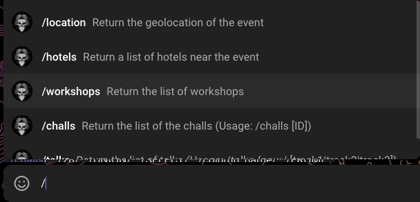
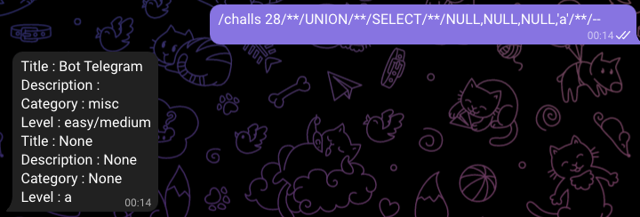
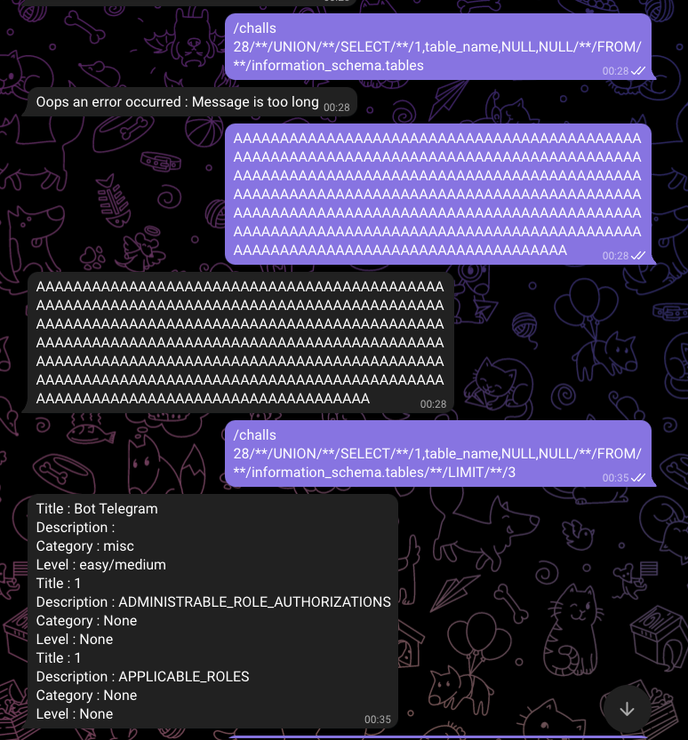
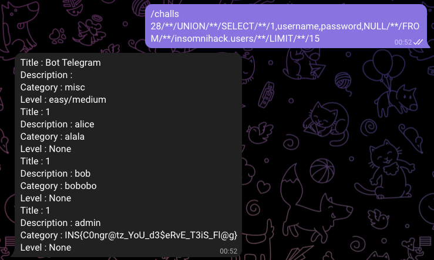

# Bot Telegram
## The Challenge
Bot Telegram was an easy challenge at the Insomnihack'22 CTF. It was the first one to be solved after the welcome challenge, after only 4 minutes, by p4-blue. Said Telegram Bot provided a set of commands to ask simple things about the event, such as the location, nearby hotels, and a list of challenges.  

## Foothold
After testing everything it seemed like the *challs* command is the only one that is interesting, as all of the others either don't take arguments at all, or only ones that seem hardcoded. *challs* takes the id of a challenge as an optional argument, and seems to directly query the database. 
To verify this, I queried a single quote, and a MySQL error returned. Unless the organizers are into rabbit holes, this must be it.  

## Scope
What is our vector?
The next step was to try a lot of different versions of either payloads or just characters to enumerate what we are allowed to do.   
Whitespaces lead to an error saying the command can only take one argument -> So we have to avoid spaces.  
Escaping a statement using a semi-colon returns some greetings from the event crew, so yet another character to avoid. But all of the other special characters seem to work fine and produce the same generic error.  
Another interesting thing: submitting *challs id* with the actual "id" instead of a number returns the set of challenges again, but without the *id* column. I initially thought this was weird, but makes a lot of sense. This would initially mean `id=id` and return everything minus the stuff that the user doesn't need anymore anyway.

## Tightening up
This again took a lot of playing aroung with differend kinds of input. In the end, *UNION SELECT* was the one that did it. Since we had to avoid whitespaces, we used the MySQL alias for it: '/**/'  
  
To see if we could get a list of tables we tried to merge our challenges table with the information_schema.tables output, but we got a very different error this time, stating that the message is too long.    
  
## Message too long
I shortened the message further, trying to query only *table_name*, and maybe only unionize using a short string and integers instead of NULL to further shorten the query but even that didn't work. I love the fact that this challenge is entirely in a chat, which means I don't even have to explain it. This screenshot just speaks words.  
  
The problem was that the queried data is too large for Telegram message bodies. The query was good each time it returned the error. :X   
If I went a different path maybe I wouldn't have encountered this.

## The solve
Finally, the flag ended up being in the *Category* of the *admin* user in *insomnihack.users*.  
I didn't solve this last part myself, congrats Manuel :D  

I really liked this challenge, since it was a refreshing way to interact with something. I caught myself looking at it when I wasn't near my laptop all the time, and having the entire history of solving it as a chat is a nice souvenir :D  

Thanks to the organizers and #flagsomeware for this amazing event!
